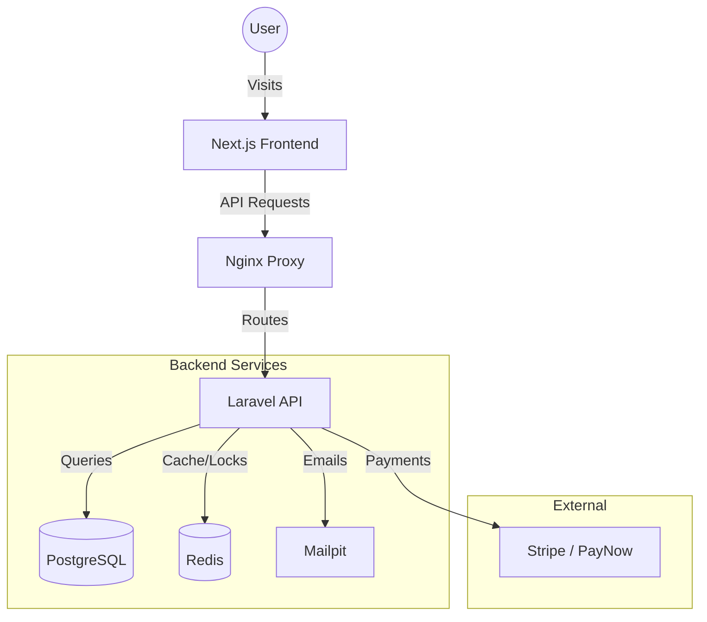
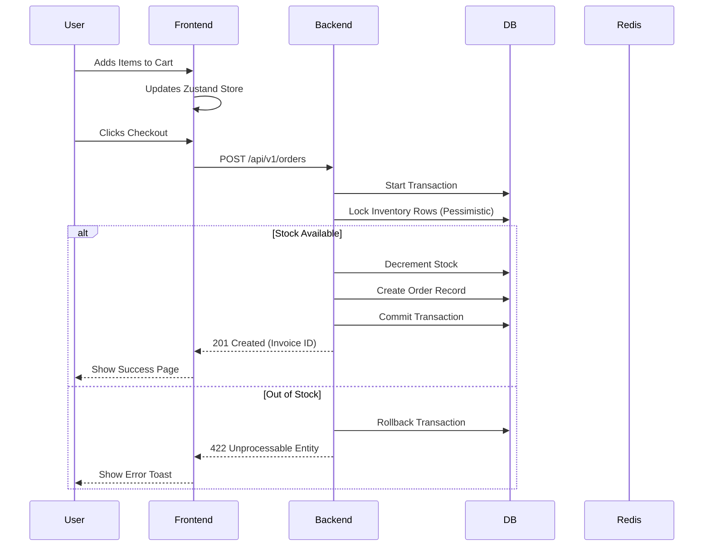

# ☕ Morning Brew Collective


> **Digital resurrection of Singaporean heritage culture into an enterprise-grade e-commerce system.**

---

## 📖 About The Project

**Morning Brew Collective** is not just an e-commerce platform; it's a technical homage to the 1970s Singaporean *kopitiam* (traditional coffee shop). We reject the "generic" minimalist aesthetic in favor of a bold, nostalgic, yet high-performance digital experience.

Under the hood, it is a robust **Headless Commerce System** designed for the strict regulatory environment of Singapore. It features a **Backend-for-Frontend (BFF)** architecture, separating the emotive UX (Next.js) from the transactional truth (Laravel).

### 🎨 The Aesthetic: "Avant-Garde Kopitiam"
*   **Visuals:** Sunburst gradients, retro typography (`Fraunces` & `DM Sans`), and tactile UI elements.
*   **Philosophy:** Intentional Minimalism. Whitespace is structural. Every animation (steam rising, beans bouncing) serves a purpose.
*   **Anti-Generic:** We use Shadcn UI primitives but strictly "retro-fit" them to avoid the default look.

---

## 🏗️ Tech Stack

We operate on the bleeding edge of stability.

| Area | Technology | Purpose |
| :--- | :--- | :--- |
| **Frontend** | **Next.js 15 (App Router)** | UX Orchestration, Server Components, React 19. |
| | **Tailwind CSS v4** | CSS-first styling, Design Tokens. |
| | **Zustand** | State Management (Cart, Filters, History). |
| | **Radix UI** | Accessible UI Primitives. |
| **Backend** | **Laravel 12** | Domain Logic, API, Queue Management. |
| | **PHP 8.3** | High-performance runtime. |
| **Database** | **PostgreSQL 16** | Relational Data, JSON support. |
| **Cache/Queue** | **Redis 7** | Two-Phase Inventory Locking, Job Queues. |
| **Infra** | **Docker Compose** | Local orchestration. |
| | **Nginx** | Reverse Proxy & SSL Termination. |

---

## 🇸🇬 Singapore Compliance Layer

This project is built to meet real-world enterprise requirements in Singapore.

### 1. GST 9% Precision
Prices and totals are handled with extreme precision using `DECIMAL(10,4)` in the database to prevent rounding errors. The frontend display logic strictly adheres to IRAS tax-inclusive display standards.

### 2. Payments via PayNow
Integrated with Stripe to support **PayNow**, Singapore's preferred real-time payment method, alongside standard credit cards.

### 3. InvoiceNow (PEPPOL) Ready
The backend `InvoiceService` generates **UBL 2.1 compliant XML** invoices, ready for transmission via the PEPPOL network, satisfying government B2B mandates.

### 4. PDPA Architecture
Personal data is treated with maximum care.
*   **Pseudonymization:** User identifiers are hashed (SHA256 + Salt) for audit logs.
*   **Consent Audit:** Every consent action is logged with a timestamp, IP, and a hash of the specific wording agreed to.

---

## 🚀 Quick Start

Get the kopitiam running on your local machine in under 5 minutes.

### Prerequisites
*   Docker & Docker Compose
*   Make (optional, but recommended)

### Installation

1.  **Start the Infrastructure:**
    ```bash
    make up
    ```
    *This spins up Postgres, Redis, Laravel (Backend), Next.js (Frontend), and Mailpit.*

2.  **Install Dependencies:**
    ```bash
    make install
    ```

3.  **Run Migrations:**
    ```bash
    make migrate
    ```

4.  **Visit the Shop:**
    *   **Frontend:** [http://localhost:3000](http://localhost:3000)
    *   **Backend API:** [http://localhost:8000](http://localhost:8000) (Proxied)
    *   **Mailpit:** [http://localhost:8025](http://localhost:8025)

### Development Commands

| Command | Description |
| :--- | :--- |
| `make up` | Start all containers in detached mode. |
| `make down` | Stop all containers. |
| `make logs` | Tail logs for all services. |
| `make shell-backend` | SSH into the Laravel container. |
| `make shell-frontend` | SSH into the Next.js container. |
| `make test` | Run E2E (Playwright) and Unit (Pest) tests. |

---

## 📂 Project Structure

A Monorepo designed for separation of concerns.

```text
/
├── backend/                # Laravel 12 Application
│   ├── app/                # Domain Models, Services (Inventory, Payment)
│   ├── database/           # Migrations, Seeders
│   └── tests/              # Feature & Unit Tests (Pest)
├── frontend/               # Next.js 15 Application
│   ├── src/app/            # App Router (Pages)
│   ├── src/components/     # Retro-styled UI Components
│   └── src/stores/         # Zustand State Logic
├── infra/                  # Infrastructure Configuration
│   ├── postgres/           # DB Init Scripts
│   └── monitoring/         # Prometheus Config
├── docs/                   # Architecture & API Documentation
└── docker-compose.yml      # Orchestration
```

### Key Files Overview

- **`frontend/src/app/globals.css`**: The heart of the design system. Contains the Tailwind v4 configuration, custom animations, and heritage color palette.
- **`backend/app/Services/InventoryService.php`**: Critical business logic for inventory management using pessimistic locking to prevent overselling.
- **`backend/app/Models/Order.php`**: Handles the complex GST calculations (inclusive pricing logic) and invoice generation.
- **`infra/docker-compose.yml`**: Defines the multi-container environment ensuring parity between local development and production.

---

## 🔄 Application Flow



### Order Creation Flow



---

## 🤝 Contributing

We welcome contributions that align with our **"Meticulous"** philosophy.

1.  **Fork the repository.**
2.  **Create your feature branch:** `git checkout -b feature/amazing-feature`.
3.  **Commit your changes:** `git commit -m 'Add some amazing feature'`.
4.  **Push to the branch:** `git push origin feature/amazing-feature`.
5.  **Open a Pull Request.**

**Design Pledge:** Please do not use generic UI libraries without styling them to match the project's specific "Retro Kopitiam" aesthetic.

---

## 📄 License

Distributed under the MIT License. See `LICENSE` for more information.

### MIT License

Copyright (c) 2026 Morning Brew Collective Team

Permission is hereby granted, free of charge, to any person obtaining a copy
of this software and associated documentation files (the "Software"), to deal
in the Software without restriction, including without limitation the rights
to use, copy, modify, merge, publish, distribute, sublicense, and/or sell
copies of the Software, and to permit persons to whom the Software is
furnished to do so, subject to the following conditions:

The above copyright notice and this permission notice shall be included in all
copies or substantial portions of the Software.

THE SOFTWARE IS PROVIDED "AS IS", WITHOUT WARRANTY OF ANY KIND, EXPRESS OR
IMPLIED, INCLUDING BUT NOT LIMITED TO THE WARRANTIES OF MERCHANTABILITY,
FITNESS FOR A PARTICULAR PURPOSE AND NONINFRINGEMENT. IN NO EVENT SHALL THE
AUTHORS OR COPYRIGHT HOLDERS BE LIABLE FOR ANY CLAIM, DAMAGES OR OTHER
LIABILITY, WHETHER IN AN ACTION OF CONTRACT, TORT OR OTHERWISE, ARISING FROM,
OUT OF OR IN CONNECTION WITH THE SOFTWARE OR THE USE OR OTHER DEALINGS IN THE
SOFTWARE.

---

<div align="center">
  <p>Built with ☕ and code by the Morning Brew Collective Team.</p>
</div>